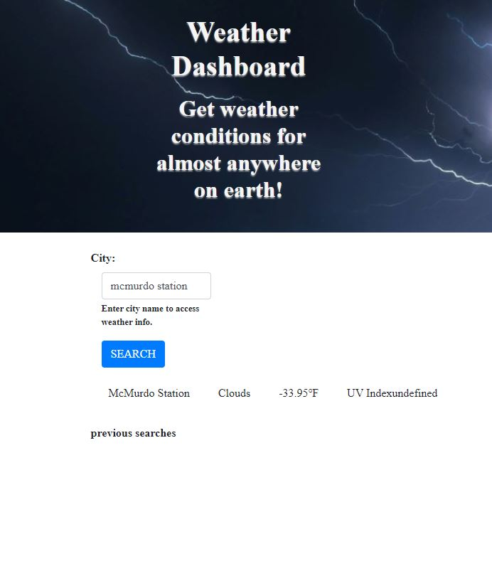

# Weather Dashboard

   
  
   
  
   
  
   
  
   
  
  
## Description

  Develop a weather dashboard application that runs in the browser, and provides the user with the weather outlook for the city of their choice. The application will retrieve weather data using the OpenWeather One Call API, and will feature dynamically updated HTML and CSS.

* Include form inputs that allow the user to search for a city.

* When the user searches for a city they are presented with current and future weather conditions, and search history is added to persistent storage.

* When current weather conditions for the city are displayed, the user is presented with the city name, the date, an icon representation of weather conditions, the temperature, the humidity, the wind speed, and the UV index.

* The UV index must diplay a color that indicates whether the conditions are favorable, moderate, or severe.

* Future weather conditions for the city must include a 5-day forecast that displays the date, an icon representation of weather conditions, the temperature, the wind speed, and the humidity.

* When a city listed in the search history is clicked, the user is presented with current and future weather conditions for that city.

## Table of Contents

* [Description](#description)
* [Documentation](#documentation)
* [Deployment](#deployment)
* [Screenshot](#screenshot)
* [Features](#features)
* [Acknowledgements](#acknowledgements)
* [License](#license)
* [Testing](#testing)
* [Contact](#contact)
## Documentation

* OpenWeather One Call API: <https://openweathermap.org/api/one-call-api>

## Deployment

* This application is deployed with GitHub Pages: <https://ratalla816.github.io/weather-dashboard/>

## Application Screenshot

#### acknowledgements

* Nathan Szurek (Tutor)

* Server-Side APIs Challenge: Weather Dashboard - KU Coding Bootcamp, Module 6 Challenge Assignment © 2021 Trilogy Education Services, LLC, a 2U, Inc.
brand Confidential and Proprietary. All Rights Reserved.

* OpenWeather One Call API © 2012 — 2021 All rights reserved.
Openweather Ltd., 4 Queens Road, Wimbledon SW19 8YB, United Kingdom

* Git it Done: KU Coding Bootcamp, Module 6 Activity © 2021 Trilogy Education Services, LLC, a 2U, Inc. brand. Confidential and Proprietary. All Rights Reserved.

 ## License
  
   

Permission is hereby granted, free of charge, to any person obtaining a copy of this software and associated documentation files (the "Software"), to deal in the Software without restriction, including without limitation the rights to use, copy, modify, merge, publish, distribute, sublicense, and/or sell copies of the Software, and to permit persons to whom the Software is furnished to do so, subject to the following conditions:

The above copyright notice and this permission notice shall be included in all copies or substantial portions of the Software.

THE SOFTWARE IS PROVIDED "AS IS", WITHOUT WARRANTY OF ANY KIND, EXPRESS OR IMPLIED, INCLUDING BUT NOT LIMITED TO THE WARRANTIES OF MERCHANTABILITY, FITNESS FOR A PARTICULAR PURPOSE AND NONINFRINGEMENT. IN NO EVENT SHALL THE AUTHORS OR COPYRIGHT HOLDERS BE LIABLE FOR ANY CLAIM, DAMAGES OR OTHER LIABILITY, WHETHER IN AN ACTION OF CONTRACT, TORT OR OTHERWISE, ARISING FROM, OUT OF OR IN CONNECTION WITH THE SOFTWARE OR THE USE OR OTHER DEALINGS IN THE SOFTWARE.

## Testing
  NA

<<<<<<< HEAD
## Contact:
=======
  ## Contact:
>>>>>>> develop
  Holler at me! <a href="mailto:rob.atalla@ratalla816.com">rob.atalla@ratalla816.com</a>
